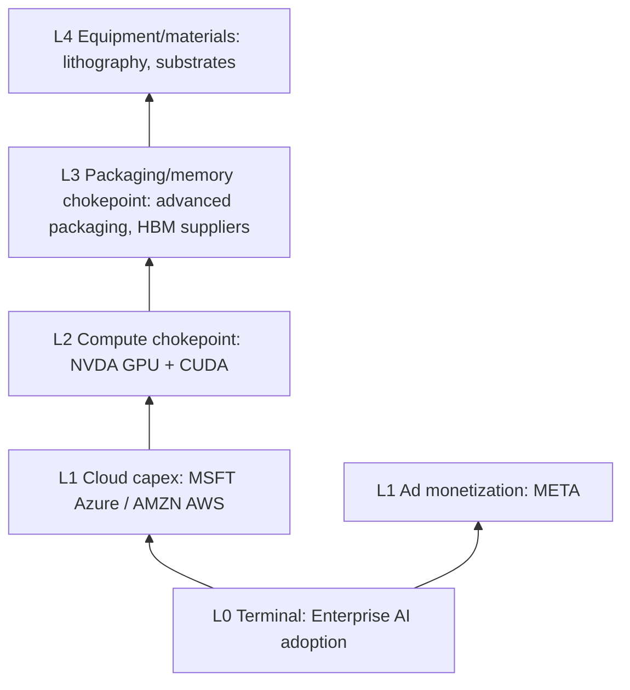

# Terminal → Upstream Chain Map (US Tech / AI)

Update when terminal demand shifts. **Always start from L0**, never from ticker hype.

## L0 Terminal demand (current cycle)

| Demand anchor | Driver | Growth | Horizon |
|---------------|--------|--------|---------|
| Enterprise AI inference | Copilot, cloud AI APIs | High | 3y structural |
| Consumer AI devices | On-device models | Medium | 2y |
| Digital advertising | Re-opening of ad budgets | Cyclical | 12m |

**Primary chain for this project:** Enterprise AI inference → Cloud Capex → GPU → software stack.

---

## Upward decomposition

---

## Node registry (tokenized universe)

| Symbol | Layer | Real chain role | Typical A hits | Token note |
|--------|-------|-----------------|----------------|------------|
| NVDA | L2 | AI accelerator + software stack | A1 A2 A4 A5 | Direct |
| MSFT | L1 | Cloud + enterprise AI distribution | A1 (platform) B7 strong | Direct |
| AMZN | L1 | AWS capex + logistics | A2 capex cycle | Direct |
| AAPL | L0–L1 | Device terminal + ecosystem | B2 diversified | Direct |
| META | L1 | Ad terminal monetization | A6 varies | Direct |

**Gap:** L3–L4 (TSMC, ASML, HBM pure-plays) often **not tokenized** → document as logic chokepoints; use NVDA as partial proxy only if B1–B2 support.

---

## Screening priority by layer (low attention first)

When scanning bottom-up, check **upstream first** for A6 (low attention):

1. L4 equipment / materials — usually highest bottleneck, lowest token coverage  
2. L3 packaging / specialty semis  
3. L2 compute — crowded (NVDA); require **B10 not 透支** to overweight  
4. L1 cloud — quality anchor, lower bottleneck score  
5. L0 consumer — demand anchor, not always chokepoint  

---

## Regime tilt (after screening)

Apply `rules.md` defaults only when B1–B10 incomplete.  
When B10=**valuation 透支** on NVDA → cap weight regardless of RISK-ON.
